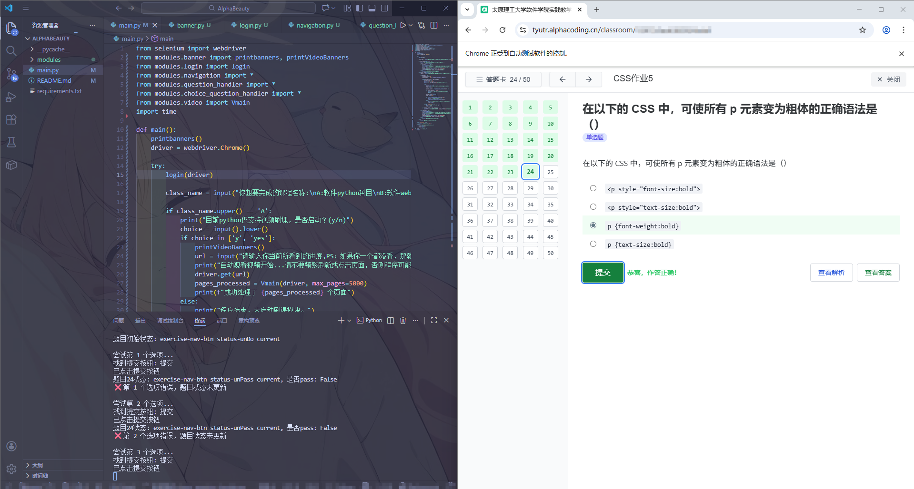
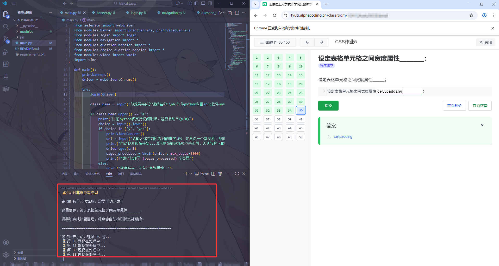

# AlphaBeauty


<p align="center">
  <a href="https://github.com/c-Mitunlny/AlphaBeauty">
    
  </a>


  <h3 align="center">AlphaBeauty</h3>
  <p align="center">
    一个简易的针对Alpha编程平台设计的刷课小工具
    <br />
    <a href="https://github.com/c-Mitunlny/AlphaBeauty"><strong>探索本项目的文档 »</strong></a>
    <br />
    <br />
    <a href="https://github.com/c-Mitunlny/AlphaBeauty">查看Demo</a>
    ·
    <a href="https://github.com/c-Mitunlny/AlphaBeauty/issues">报告Bug</a>
    ·
    <a href="https://github.com/c-Mitunlny/AlphaBeauty/issues">提出新特性</a>
  </p>

</p>


 本篇README.md面向使用/开发者

## 目录

- [上手指南](#上手指南)
  - [开发前的配置要求](#开发前的配置要求)
  - [安装及运行步骤](#安装及运行步骤)
- [文件目录说明](#文件目录说明)
- [功能简介](#功能简介)
- [贡献者](#贡献者)
- [版本控制](#版本控制)
- [作者](#作者)

### 上手指南

注意：

1. 请先安装依赖
2. 程序运行后，包括账号密码等所有输入操作均在终端内输入，切勿点击浏览器页面


###### 开发前的配置要求

1. python3.12
2. selenium==4.39.0


###### **安装及运行步骤**

1. Clone the repo

```sh
git clone https://github.com/c-Mitunlny/AlphaBeauty.git
```

2. install selenium

```bash
pip install selenium
```

3. run main.py

```bash
python3 main.py
```

### 文件目录说明

```
AlphaBeauty
├── /__pycache__/
├── choice_question_handler.py
├── main.py
├── README.md
├── requirements.txt
└─  video.py

```

### 功能简介

以tyut的alpha为例，大学内会有两项课程，即：

1. python面向对象
2. web程序设计

以web为例，需要完成的作业分为： 【课堂】和【作业】两大块，第一为许多道视频和题目的综合，第二为纯作业。

Alpha针对两个模块均提供解决方案。

#### 【课堂】模块：

由于存在许多非选择题，和ai判题情况，本项目目前仅提供视频自动刷课解决方案，运行脚本后可以自动观看该模块内的视频，自动跳转到下一个视频，直到所有视频全部解决。

解决的判定标准是根据平台的特性，视频不需要全部看完，只需要看一段时间即可结算成绩，标记为完成。本项目每个视频以总时长50%的标准为完成标准，自动开启2倍速，大大节约时间成本。

#### 【作业】模块：

以web为例，存在许多作业，一个作业内有很多题目，组成包含选择，判断，填空和编程。本项目解决方案仅提供选择题和判断题，遇到非选择题时，会自动提醒用户进行手动处理。

其中，选择和判断题目采用轮询进行尝试解决。

示例图：






### 贡献者

[Mitunlny](https://github.com/c-Mitunlny)

### 版本控制

该项目使用Git进行版本管理。您可以在repository参看当前可用版本。

### 作者

[Mitunlny](https://github.com/c-Mitunlny)
